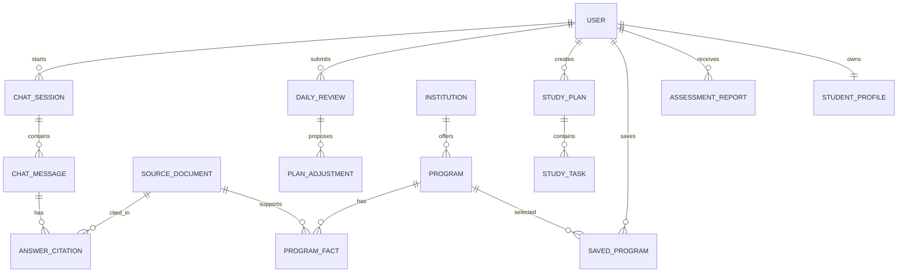
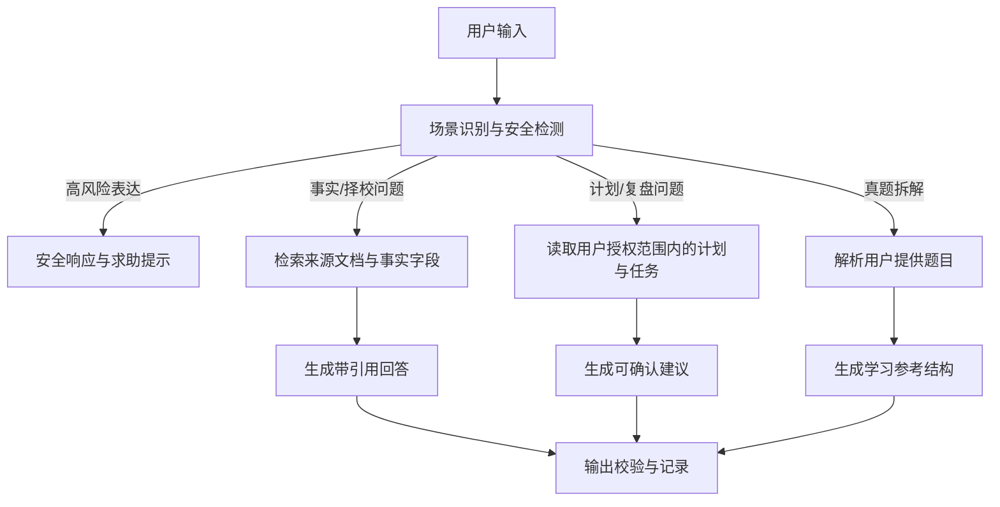
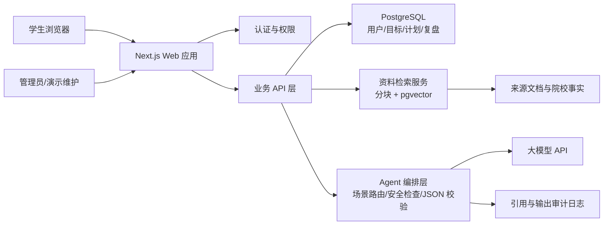

# 研途智伴 Agent 产品规格说明书

| 项目项 | 内容 |
| --- | --- |
| 产品名称 | 研途智伴 Agent |
| 项目类型 | 本科《数字营销》课程项目 / Web 智能应用 |
| 文档版本 | v1.0 |
| 编写日期 | 2026-05-23 |
| 首版服务对象 | 有考研意向的本科生，优先服务经管类、市场营销相关专业学生 |
| MVP 目标 | 让用户从“我该怎么选、怎么开始”进入“有依据地选择、有计划地学习、每天可复盘”的闭环 |

## 0. 产品概述

研途智伴 Agent 是一款面向中国考研学生的网页端智能备考平台。产品围绕“诊断定位 - 择校比较 - 计划执行 - 知识答疑 - 复盘调整”建立连续服务链路，以结构化信息和大模型智能体降低信息搜集成本、规划成本与备考焦虑。

### 0.1 首版产品假设

1. 用户的首要困难不是缺少内容，而是不知道自身条件适合什么目标、信息是否可信、今日究竟应该做什么。
2. 经管类和市场营销相关专业的用户可共享较高比例的择校、专业课信息整理框架，适合首版聚焦验证。
3. 课程展示需要体现智能体价值，但不能把不确定的院校录取结果包装为确定结论。
4. MVP 不追求覆盖全国所有院校数据，采用“精选院校样本数据 + 明确来源标记 + 可扩展数据模型”的策略。

### 0.2 产品目标与非目标

**产品目标**

- 帮助用户在 10 分钟内完成考研画像并获得初步定位建议。
- 支持用户基于可追溯信息比较目标院校与专业，减少盲目决策。
- 将长期备考目标拆解为阶段计划、周计划和今日任务。
- 以问答、真题拆解和复盘形成持续学习反馈。
- 在焦虑或低效状态下提供支持性交流和可执行的小步骤建议。

**首版非目标**

- 不承诺预测录取概率或给出“必上岸”结论。
- 不替代研招网、院校官网、招生简章等官方信息源。
- 不构建在线课程、支付、直播、完整题库交易平台。
- 不进行心理诊断、危机治疗或医疗建议。

## 1. 产品一句话定位

**研途智伴 Agent 是面向经管类考研学生的可信智能备考搭档，通过画像诊断、可溯源择校比较和动态学习计划，陪伴用户从选目标到每日执行。**

## 2. 用户痛点分析

### 2.1 核心用户画像

| 维度 | 典型特征 |
| --- | --- |
| 年龄与阶段 | 20-24 岁，本科大三、大四或应届备考用户 |
| 专业范围 | 首版重点为市场营销、工商管理、管理科学、应用经济等经管相关专业 |
| 当前状态 | 有考研意愿，但目标院校、备考节奏或资料来源尚不清晰 |
| 信息行为 | 在社交平台、经验帖、机构内容和官网之间反复搜索，难判断时效性与可信度 |
| 情绪状态 | 易受到同伴进度、报录数据、复习落后感影响，产生焦虑或拖延 |
| 核心期待 | 快速梳理个人情况，获得合理选项、明确下一步，并能持续纠偏 |

### 2.2 关键痛点与产品机会

| 用户阶段 | 具体痛点 | 产生后果 | 产品应对方式 | MVP 优先级 |
| --- | --- | --- | --- | --- |
| 决定考研 | 不确定学硕/专硕、跨考与否、适配方向 | 长期观望，错过准备窗口 | 画像问卷与方向诊断报告 | P0 |
| 择校定位 | 分数线、考试科目、招生人数等信息散落且年份混乱 | 只凭“热门”或他人建议做选择 | 院校对比卡片、来源和年份标记、风险提示 | P0 |
| 制定计划 | 网上计划模板无法匹配基础、考试科目和可用时间 | 计划第一周即失效 | 基于画像与目标的阶段/周计划生成 | P0 |
| 复习执行 | 今日任务不清晰，任务过量或遗漏 | 拖延、失去掌控感 | 今日任务面板、完成打卡、复盘调整 | P0 |
| 查询知识 | 不知道招生规则、术语或备考方法应信谁 | 反复搜索、误读政策 | 带引用的知识库问答 | P0 |
| 专业学习 | 真题看过答案仍不理解考点和答题结构 | 低质量刷题 | 真题文本拆解与作答建议 | P1 |
| 心态波动 | 感到落后、孤独、过度比较 | 放弃计划或过度消耗 | 支持性对话与恢复行动建议 | P1 |
| 后期决策 | 报名、冲刺、复试环节复杂 | 忘记关键事项 | 里程碑提醒与复试支持 | 暂缓 |

### 2.3 需求优先级结论

MVP 必须首先解决两个问题：**用户该往哪里走**和**用户今天该做什么**。因此“画像 - 择校 - 计划 - 执行复盘”是产品主链路；知识问答提供可信度支撑；真题拆解和情绪陪伴用于体现智能体差异化能力，但控制在可展示、可验证的范围内。

## 3. 用户使用流程

### 3.1 核心旅程


### 3.2 首次使用流程

| 步骤 | 用户操作 | 系统反馈 | 必要数据 | 成功条件 |
| --- | --- | --- | --- | --- |
| 1. 进入产品 | 查看产品价值与示例 | 展示服务范围、数据免责声明和登录入口 | 无 | 用户点击开始测评 |
| 2. 登录/体验 | 邮箱或演示账号进入 | 创建账户或体验会话 | 用户基础账户 | 进入画像问卷 |
| 3. 画像采集 | 回答本科情况、目标、基础、时间与偏好 | 保存进度并校验必填项 | 用户画像 | 提交完整问卷 |
| 4. 诊断报告 | 查看优势、风险和建议方向 | 输出结构化报告及待补信息 | 画像、规则、Agent 输出 | 用户收藏建议方向或进入择校 |
| 5. 择校定位 | 筛选院校专业、查看详情、加入比较 | 展示对比表、来源日期和“冲稳保”解释 | 院校专业数据 | 至少选定 1 个目标专业 |
| 6. 计划生成 | 输入考试日期、可用时间和选择科目 | 生成阶段计划及首周任务 | 画像、目标、日历 | 用户确认计划 |
| 7. 开始执行 | 完成今日任务或进入问答 | 更新进度并推荐下一动作 | 任务与会话 | 完成至少一项任务 |

### 3.3 日常复习流程

1. 用户登录后首先看到今日任务、完成比例和距目标考试节点的阶段提示。
2. 用户可完成/延期任务，并填写学习时长与卡点。
3. 学习中遇到问题时，进入知识问答；涉及招生信息的回答必须显示资料来源及适用年份。
4. 用户可粘贴一题真题文本，获得“考点 - 解题思路 - 作答框架 - 易错点”拆解。
5. 当日结束后填写复盘：完成情况、精力、情绪、困难和明日可用时间。
6. 智能体输出当日总结与次日微调建议；重大目标调整需用户主动确认后才写入计划。

### 3.4 异常与回流流程

| 情形 | 产品响应 |
| --- | --- |
| 画像信息未填全 | 保存草稿，标识缺失信息，允许先浏览但不生成正式定位结论 |
| 用户未找到目标院校 | 提供筛选建议，并明确首版数据范围有限，允许提交待补充院校 |
| 问答无可验证来源 | 回复“当前知识库未找到可确认依据”，给出官方查询路径，不生成确定性事实 |
| 连续 3 天未打卡 | 返回后提供轻量恢复方案，不自动堆叠所有逾期任务 |
| 用户表达严重心理危机或自伤风险 | 停止普通备考建议，提示联系亲友、学校心理中心或紧急支持渠道 |

## 4. MVP 功能范围

### 4.1 MVP 交付边界

MVP 以 Web 响应式页面完成演示，支持一名用户从画像诊断到每日复盘的完整路径。院校与知识库内容聚焦经管/市场营销相关示例数据，后台可通过数据脚本或简易管理入口维护，不要求覆盖所有专业。

### 4.2 功能模块

#### 4.2.1 用户账户与演示模式（P0）

**目的**：保存画像、计划、会话和复盘记录，支持课堂快速演示。

**功能**

- 注册、登录、退出；可选用邮箱验证码或第三方认证服务。
- 提供固定演示账号或“一键体验”入口，内置脱敏样例画像和示例数据。
- 首次登录引导填写画像，已填写用户直接进入工作台。

**验收条件**

- 登录后能识别当前用户并读取其计划、任务和收藏目标。
- 演示账号不会显示真实个人数据，且可一键重置演示过程。

#### 4.2.2 考研画像诊断（P0）

**输入字段**

| 分类 | 字段示例 | 是否必填 |
| --- | --- | --- |
| 基础信息 | 当前年级、本科专业、目标考试年度 | 是 |
| 学习基础 | 英语自评、数学/专业课基础、四六级情况、绩点区间 | 是 |
| 目标偏好 | 意向地区、院校层次偏好、学硕/专硕倾向、是否跨考 | 是 |
| 时间与资源 | 每周可学习小时数、开始备考月份、预算/是否接受报班 | 是 |
| 风险偏好 | 更在意成功稳妥或冲击目标、是否接受调剂 | 是 |

**输出结构**

- 用户当前状态摘要：基础、资源、偏好、主要限制。
- 目标方向建议：建议探索的专业方向与理由，不直接承诺院校适配。
- 风险提示：例如数学基础薄弱但目标科目要求高、备考时间偏紧等。
- 下一步清单：补全信息、进入择校筛选、生成初始计划。

**Agent 行为**

- 先依据必填字段与可解释规则生成结构化标签，再由大模型生成自然语言说明。
- 报告中区分“用户自述”“系统推断”“仍需核实的信息”。

**验收条件**

- 用户提交问卷后 10 秒内得到报告或可重试错误提示。
- 诊断报告能被再次打开，重新提交问卷后生成新版本。

#### 4.2.3 院校与专业定位对比（P0）

**目的**：用清晰、可追溯的对比信息支持用户做目标选择。

**首版数据范围**

- 预置若干所经管或市场营销相关招生专业作为演示样本。
- 每条关键招生信息包含来源名称、来源地址、发布/抓取日期、适用招生年度与核验状态。

**核心功能**

- 按地区、专业名称、学硕/专硕、考试科目标签筛选。
- 查看院校专业详情：招生方向、初试科目、参考资料（若来源支持）、往年公开数据字段、备注与来源。
- 收藏院校专业，最多选择 3 个目标进行横向对比。
- 由智能体依据画像与已核验字段生成“适配点、挑战点、需自行确认事项”。
- 用户确认一个“当前主目标”和最多两个“备选目标”，用于计划生成。

**重要规则**

- “冲/稳/保”仅作为相对风险提示，必须展示依据字段和不可预测声明。
- 缺少官方数据的字段显示“暂无可核实信息”，不得由模型补齐。

**验收条件**

- 对比页能展示同字段并排比较以及来源入口。
- Agent 建议中引用的数据必须来自当前对比记录或知识库检索结果。

#### 4.2.4 备考计划生成与今日任务（P0）

**输入**

- 目标考试年度与目标专业。
- 科目列表与用户基础等级。
- 每周可学习时段、固定不可用时段。
- 当前日期、计划开始日和阶段目标。

**输出**

| 层级 | 内容 | 示例 |
| --- | --- | --- |
| 阶段计划 | 基础、强化、真题/冲刺等阶段及目标 | 6-8 月完成核心教材首轮 |
| 周计划 | 本周各科目标、预计总时长 | 英语阅读 4 篇，专业课 3 章 |
| 今日任务 | 可勾选任务、预计时长、优先级 | 专业课章节笔记 90 分钟 |

**操作**

- 生成、确认、手动编辑计划。
- 完成、延期或删除单项任务，并记录实际时长。
- 复盘后由 Agent 建议调整未开始任务；用户点击确认后落库。

**计划约束**

- 默认单日计划时长不得超过用户自报可用时间。
- 逾期任务不自动无限滚存；系统应建议删减、拆分或重新排期。
- 所有 AI 调整均保存调整原因和版本。

**验收条件**

- 确认目标后能生成至少 4 周初步计划和当周具体任务。
- 用户完成任务后，工作台进度状态实时更新。

#### 4.2.5 考研知识库问答（P0）

**覆盖内容**

- 平台收录院校专业信息及来源说明。
- 常见考研术语、备考阶段方法论、经管类复习常见问题。
- 课程展示可准备 20-50 条高质量资料片段作为知识库样本。

**问答体验**

- 用户提出自然语言问题。
- 系统检索知识库后回答，并展示引用资料卡片：资料标题、适用年份、来源类型、更新时间。
- 若问题涉及具体招生政策、报名日期、考试科目或分数数据，必须基于命中文档作答。
- 允许用户对回答标注“有帮助/信息不准确/需要补充来源”。

**验收条件**

- 有命中文档时，回答至少展示一条引用。
- 无可靠检索结果时不编造回答，并提供核实建议。

#### 4.2.6 真题拆解助手（P1，纳入 MVP 展示版）

**首版范围**

- 支持用户粘贴文本题目和可选的个人答案，不实现大规模版权题库分发。
- 重点支持经管类名词解释、简答、论述、案例分析题的结构拆解。

**输出模板**

1. 题型与可能考查能力。
2. 关键词和核心考点。
3. 作答框架及建议篇幅/层次。
4. 用户答案反馈（用户提供答案时）。
5. 延伸复习任务建议。

**限制**

- 对来源不明或可能受版权保护的整套试卷，不提供批量复制传播功能。
- 不声称输出为标准答案，标注为学习参考。

**验收条件**

- 输入一条示例论述题后可得到结构化拆解结果。
- 可将拆解建议一键加入今日或本周任务。

#### 4.2.7 每日复盘与轻量情绪陪伴（P1，纳入 MVP 展示版）

**复盘输入**

- 今日任务完成比例、实际学习分钟数。
- 最大困难、明日可用时间。
- 情绪选择（平稳、焦虑、疲惫、挫败、有动力）与可选文字描述。

**输出**

- 客观总结：完成了什么、计划偏差是什么。
- 明日行动建议：至多 3 项，能直接执行。
- 可选计划调整草案：需用户确认。
- 支持性文字：不进行心理诊断或过度承诺。

**安全触发**

- 检测到自伤、自杀、严重绝望等危机表达时，展示安全提示与求助建议，不继续生成普通激励内容。

**验收条件**

- 提交复盘后能保存记录并显示智能总结。
- 用户确认调整建议后，次日任务随之改变并记录调整原因。

### 4.3 MVP 端到端验收场景

| 编号 | 演示场景 | 验收结果 |
| --- | --- | --- |
| E2E-01 | 新用户填写画像，偏好华东地区、经管专业、时间有限 | 获得含风险提示的诊断报告并可前往筛选 |
| E2E-02 | 用户收藏 3 个院校专业并对比 | 页面显示字段差异、信息年份和来源，Agent 输出有依据建议 |
| E2E-03 | 用户选定主目标并生成计划 | 得到阶段/周/日任务，可勾选完成 |
| E2E-04 | 用户询问某目标专业初试科目 | 若数据已收录，回答显示来源；否则明确提示核实 |
| E2E-05 | 用户粘贴一题市场营销论述题 | 输出考点与作答框架，并能加入任务 |
| E2E-06 | 用户复盘称进度落后且焦虑 | 输出短期恢复建议，确认后更新任务 |

## 5. 非 MVP 功能暂缓列表

| 功能 | 暂缓原因 | 后续验证条件 |
| --- | --- | --- |
| 全国全专业院校数据库 | 数据采集、校验和维护成本高，首版难保证准确性 | 验证用户确有跨专业扩展需求，并建立数据运营流程 |
| 自动预测上岸概率/排名 | 存在误导风险且缺乏充分可解释数据 | 获得可靠公开数据与合规评估后仅作区间提示 |
| OCR 上传整套试卷与题库商城 | 涉及识别质量、版权和内容运营 | 明确授权题库来源后再规划 |
| 直播课程、付费课程推荐 | 偏离核心验证路径，增加交易合规复杂度 | 用户对内容服务付费意愿被验证 |
| 学习社区、打卡排行榜 | 需审核治理，可能增加用户比较焦虑 | 核心个人学习闭环留存稳定 |
| 导师/学长撮合咨询 | 身份真实性和服务质量难保障 | 建立认证与评价机制 |
| 自动同步日历和消息推送 | 涉及外部授权与通知工程量 | 日常任务使用频率被验证 |
| 复试模拟面试与调剂助手 | 属于初试之后的扩展旅程 | MVP 完成且课程范围需要延展 |
| 原生移动 App / 小程序 | 首版 Web 足以完成验证 | 移动端活跃与通知需求明确 |
| 专业心理服务 | 超出产品专业能力与责任范围 | 与持证专业机构合作后再讨论 |

## 6. 页面清单

### 6.1 信息架构

```text
公开区域
  首页 / 产品介绍
  登录 / 注册
用户区域
  工作台
  画像问卷
  诊断报告
  院校专业库
  院校专业详情
  对比与目标确认
  我的计划
  今日任务
  知识问答
  真题拆解
  每日复盘
  资料来源中心
  个人设置与隐私
管理/演示区域
  内容与院校数据维护（轻量）
```

### 6.2 页面级规格

| 页面 | 路由建议 | 核心内容 | 主要操作 | 关键状态/异常 |
| --- | --- | --- | --- | --- |
| 首页 | `/` | 价值主张、能力卡片、可信说明、演示入口 | 开始体验、登录 | 无数据时仍可展示样例 |
| 登录/注册 | `/auth` | 账号表单、一键演示 | 登录、注册、进入演示 | 登录失败、验证码过期 |
| 工作台 | `/dashboard` | 当前目标、今日任务、学习进度、快捷 Agent 入口 | 完成任务、提问、复盘 | 未完成画像时显示引导 |
| 画像问卷 | `/profile/assessment` | 分步表单、完成进度 | 暂存、提交生成报告 | 必填项缺失、生成失败 |
| 诊断报告 | `/profile/report/:id` | 状态摘要、建议方向、风险、下一步 | 更新画像、去择校 | 报告版本历史 |
| 院校专业库 | `/programs` | 筛选区、列表卡片、来源日期 | 筛选、收藏、比较 | 数据范围说明、无结果 |
| 院校专业详情 | `/programs/:id` | 科目、招生公开信息、资料来源、更新时间 | 收藏、加入比较、提问 | 字段缺失需醒目标注 |
| 对比与目标确认 | `/compare` | 最多 3 项并排对比、AI 适配解读 | 移除、设主目标、生成计划 | 未选择项目时空状态 |
| 我的计划 | `/plan` | 阶段时间轴、周任务、版本记录 | 编辑、重生成、确认调整 | 尚无目标时阻止生成 |
| 今日任务 | `/tasks/today` | 今日清单、预计/实际时长、进度条 | 完成、延期、拆分 | 任务过载提醒 |
| 知识问答 | `/chat/knowledge` | 消息流、资料引用卡片、反馈按钮 | 提问、追问、反馈 | 无来源回答提示 |
| 真题拆解 | `/practice/analyze` | 题目输入、答案输入、拆解结果 | 分析、加入任务 | 内容过长、敏感/侵权提示 |
| 每日复盘 | `/review/daily` | 完成数据、情绪选择、困难记录、总结 | 提交、采纳调整 | 危机表达安全提示 |
| 来源中心 | `/sources` | 数据源列表、适用年度、最后核验日期 | 查阅来源、报告问题 | 过期标记 |
| 设置与隐私 | `/settings` | 账户、数据导出/删除、AI 使用说明 | 修改、删除账户 | 二次确认 |
| 轻量管理页 | `/admin/content` | 院校数据、知识文档、来源字段 | 新增、编辑、发布/下架 | 仅管理员访问 |

### 6.3 核心组件

| 组件 | 用途 | 出现页面 |
| --- | --- | --- |
| `SourceBadge` | 展示来源类型、年份、核验状态 | 详情、对比、问答、来源中心 |
| `GoalCard` | 展示主目标与备选目标 | 工作台、对比、计划 |
| `TaskChecklist` | 任务完成、延期和实际耗时录入 | 工作台、今日任务 |
| `AgentAnswer` | 统一展示 AI 回答、引用、免责声明和反馈 | 报告、对比、问答、拆解、复盘 |
| `RiskNotice` | 展示数据缺失、判断局限和安全提示 | 对比、问答、复盘 |

## 7. 数据结构

### 7.1 数据设计原则

- **结构化事实与 AI 内容分离**：院校字段、来源和任务数据存储为结构化记录；AI 输出以版本化内容保存。
- **所有关键外部信息可追溯**：影响择校判断的字段均可关联至少一条来源记录。
- **可删除与最少收集**：不收集身份证号、准考证号、精确住址等 MVP 无需信息。
- **支持审计**：计划调整、知识回答引用和重要 Agent 输出保留生成时间及输入摘要。

### 7.2 核心实体关系



### 7.3 表结构建议

#### `users` 用户表

| 字段 | 类型 | 说明 |
| --- | --- | --- |
| `id` | UUID | 主键 |
| `email` | varchar, nullable | 登录邮箱；演示用户可为空 |
| `display_name` | varchar | 用户昵称 |
| `role` | enum | `student` / `admin` / `demo` |
| `consent_version` | varchar | 用户同意的隐私与 AI 说明版本 |
| `created_at` | timestamp | 创建时间 |
| `deleted_at` | timestamp, nullable | 软删除时间 |

#### `student_profiles` 用户画像表

| 字段 | 类型 | 说明 |
| --- | --- | --- |
| `user_id` | UUID | 关联用户，唯一 |
| `exam_year` | int | 目标招生/考试年度 |
| `undergraduate_major` | varchar | 本科专业 |
| `grade_level` | varchar | 当前年级 |
| `target_regions` | jsonb | 意向地区数组 |
| `degree_preference` | enum | `academic` / `professional` / `undecided` |
| `cross_major_intent` | boolean | 是否考虑跨考 |
| `subject_foundation` | jsonb | 英语、数学、专业课等自评 |
| `weekly_available_hours` | decimal | 每周可投入时长 |
| `risk_preference` | enum | `steady` / `balanced` / `challenge` |
| `accept_adjustment` | boolean | 是否接受调剂 |
| `updated_at` | timestamp | 更新时间 |

#### `assessment_reports` 诊断报告表

| 字段 | 类型 | 说明 |
| --- | --- | --- |
| `id` | UUID | 主键 |
| `user_id` | UUID | 用户 ID |
| `profile_snapshot` | jsonb | 生成时画像快照 |
| `tags` | jsonb | 规则生成的解释性标签 |
| `report_content` | jsonb | 摘要、方向、风险、下一步 |
| `model_name` | varchar | 生成模型标识 |
| `prompt_version` | varchar | 提示词版本 |
| `created_at` | timestamp | 生成时间 |

#### `institutions` 与 `programs` 院校专业表

| 表 | 核心字段 | 说明 |
| --- | --- | --- |
| `institutions` | `id`, `name`, `region`, `city`, `institution_tags` | 院校基础信息 |
| `programs` | `id`, `institution_id`, `program_name`, `discipline_code`, `degree_type`, `exam_year`, `status` | 具体年度专业/方向条目 |

#### `program_facts` 院校事实字段表

| 字段 | 类型 | 说明 |
| --- | --- | --- |
| `id` | UUID | 主键 |
| `program_id` | UUID | 专业条目 |
| `fact_type` | enum | `subjects` / `planned_enrollment` / `score_line` / `tuition` / `duration` / `reference_books` / `note` |
| `fact_value` | jsonb | 结构化值，可保存年份及备注 |
| `source_document_id` | UUID | 来源文档 |
| `verification_status` | enum | `verified` / `pending` / `expired` |
| `verified_at` | timestamp, nullable | 核验时间 |

#### `source_documents` 来源文档表

| 字段 | 类型 | 说明 |
| --- | --- | --- |
| `id` | UUID | 主键 |
| `title` | varchar | 文件/网页标题 |
| `publisher` | varchar | 发布方，如院校研究生院 |
| `source_type` | enum | `official` / `platform_curated` / `method_guide` |
| `source_url` | text | 来源地址 |
| `applicable_year` | int, nullable | 适用年度 |
| `published_at` | date, nullable | 发布日期 |
| `checked_at` | timestamp | 平台最后核验时间 |
| `content_text` | text | 可检索文本 |
| `embedding_ref` | varchar, nullable | 向量索引引用 |

#### `saved_programs` 用户目标选择表

| 字段 | 类型 | 说明 |
| --- | --- | --- |
| `user_id` | UUID | 用户 |
| `program_id` | UUID | 院校专业 |
| `target_role` | enum | `favorite` / `primary` / `alternative` |
| `user_note` | text, nullable | 用户备注 |
| `created_at` | timestamp | 收藏或选择时间 |

#### `study_plans` 与 `study_tasks` 学习计划表

| 表 | 核心字段 | 说明 |
| --- | --- | --- |
| `study_plans` | `id`, `user_id`, `primary_program_id`, `start_date`, `exam_date`, `status`, `version`, `generation_reason`, `created_at` | 计划版本主表 |
| `study_tasks` | `id`, `plan_id`, `task_date`, `subject`, `title`, `task_type`, `estimated_minutes`, `actual_minutes`, `priority`, `status`, `source_type` | 每日执行任务 |

`study_tasks.status` 可取：`pending`、`completed`、`deferred`、`cancelled`。

#### `daily_reviews` 与 `plan_adjustments` 复盘调整表

| 表 | 核心字段 | 说明 |
| --- | --- | --- |
| `daily_reviews` | `id`, `user_id`, `review_date`, `completed_ratio`, `study_minutes`, `mood`, `difficulty_text`, `tomorrow_available_minutes`, `agent_summary`, `risk_flag` | 每日复盘 |
| `plan_adjustments` | `id`, `review_id`, `plan_id`, `proposed_changes`, `reason`, `status`, `confirmed_at` | AI 调整建议与用户确认状态 |

#### `chat_sessions`、`chat_messages` 与 `answer_citations` 对话表

| 表 | 核心字段 | 说明 |
| --- | --- | --- |
| `chat_sessions` | `id`, `user_id`, `scene`, `created_at` | 场景可为 `knowledge` / `program_advice` / `practice` / `emotion` |
| `chat_messages` | `id`, `session_id`, `role`, `content`, `structured_output`, `safety_level`, `created_at` | 会话消息与安全级别 |
| `answer_citations` | `id`, `message_id`, `source_document_id`, `chunk_id`, `quote_summary` | 回答引用关系 |

### 7.4 Agent 结构化输出示例

诊断、计划调整等关键生成内容不应仅保存为纯文本，建议要求模型返回结构化 JSON，再由前端渲染。

```json
{
  "summary": "用户目标明确，但备考可用时间偏紧。",
  "strengths": ["已有英语学习习惯", "专业方向与本科背景相近"],
  "risks": [
    {
      "level": "medium",
      "title": "每周学习时长不足",
      "basis": "用户填写每周可投入 12 小时",
      "action": "先执行 2 周试运行，再决定目标调整"
    }
  ],
  "nextActions": [
    { "type": "compare_programs", "label": "对比 2-3 个目标专业" },
    { "type": "create_plan", "label": "生成首月学习计划" }
  ]
}
```

## 8. 智能体能力边界

### 8.1 智能体角色定义

智能体是**信息整理助手、学习规划助手和支持性陪伴者**，不是招生官方、录取预测系统、专业教师的完全替代品，也不是心理咨询师。

### 8.2 能做什么

| 场景 | 允许能力 | 必须依据 |
| --- | --- | --- |
| 画像诊断 | 总结自述信息、识别资源与风险、提出探索方向 | 用户填写数据与预设诊断规则 |
| 择校辅助 | 比较已收录的院校专业字段，解释适配与挑战 | 数据库事实字段和引用来源 |
| 计划制定 | 基于科目、时间和目标拆解任务，提出调整草案 | 用户确认的目标与可用时间 |
| 知识问答 | 回答资料库覆盖的问题，并展示引用 | 检索命中的资料片段 |
| 真题拆解 | 解析用户输入题目，提供作答框架和复习建议 | 用户输入文本、通用学科方法 |
| 复盘陪伴 | 总结执行偏差，提供温和且可执行的下一步 | 任务记录与用户复盘输入 |

### 8.3 不能做什么

| 禁止行为 | 产品处理 |
| --- | --- |
| 捏造招生人数、分数线、考试科目、报名节点或院校政策 | 无可靠来源则明确无法确认，引导查看官方信息 |
| 根据少量信息承诺录取、排名或“稳上岸” | 仅说明适配因素和风险，不输出确定结论 |
| 自动替用户变更主目标或大幅更改计划 | 提供建议草案，必须由用户确认 |
| 传播未经授权的完整付费资料或整套试卷 | 限制上传/展示方式，并进行版权提示 |
| 进行精神疾病诊断、危机干预替代或医疗建议 | 触发安全提示并引导寻求现实支持/专业帮助 |
| 在未告知情况下使用用户私密复盘内容训练模型 | 默认不用于模型训练，并在隐私说明中明示 |

### 8.4 回答分级与展示规则

| 回答类型 | 示例 | 输出要求 |
| --- | --- | --- |
| 事实型 | “某专业考试科目是什么？” | 必须引用来源、适用年度和核验时间 |
| 建议型 | “我适合冲刺还是稳妥选择？” | 展示依据、假设和风险，不给确定结论 |
| 规划型 | “帮我安排未来四周” | 提供可编辑任务并等待用户确认 |
| 学习解析型 | “拆解这道论述题” | 标记为参考框架，不声明官方答案 |
| 情绪支持型 | “我学不下去了” | 先倾听与小步骤建议；遇危机表达切换安全响应 |

### 8.5 智能体执行流程



### 8.6 Prompt 与输出控制建议

- 每个场景使用独立系统提示词：诊断、择校、计划、知识问答、真题拆解、复盘支持。
- 对事实问答，在提示词中要求“仅使用提供的检索上下文，不足则拒答”。
- 对计划与诊断，使用 JSON Schema 校验字段后再显示给用户。
- 记录 `prompt_version`、`model_name`、引用列表和安全分类，便于演示与回溯。
- 设置输出长度和敏感词检查，避免聊天变成无边界咨询。

## 9. 信息准确性和隐私保护原则

### 9.1 信息准确性原则

| 原则 | 落地要求 |
| --- | --- |
| 官方优先 | 院校招生信息优先采纳研招相关官方平台、院校研究生招生网站或正式文件 |
| 年份明确 | 科目、招生计划、分数等字段必须关联适用年度，跨年度不得默认沿用 |
| 来源可见 | 用户能在详情、对比与问答回答中看到来源标题、发布日期/核验日期及入口 |
| 不足即说明 | 数据缺失、来源过期或相互冲突时，显示需用户核实，不用 AI 猜测填充 |
| 事实与建议分开 | 事实字段使用清晰卡片展示；Agent 建议必须写明“依据这些信息的分析” |
| 可纠错 | 用户可举报错误信息；管理员能修订数据并记录更新时间 |

### 9.2 数据核验状态设计

| 状态 | 含义 | 前台展示 |
| --- | --- | --- |
| `verified` | 已依据指定年度官方来源人工核验 | “已核验”及核验日期 |
| `pending` | 已收集但尚未完成核验 | “待核验，仅供参考” |
| `expired` | 信息对应年度已过或来源需要更新 | “历史信息，请确认最新公告” |

### 9.3 隐私保护原则

| 原则 | 具体实施 |
| --- | --- |
| 最小必要收集 | 只收集画像、目标、任务与复盘需要的信息，不收集身份证、准考证、精确地址 |
| 明示同意 | 首次使用时说明 AI 会处理哪些数据、用途是什么、是否调用第三方模型 |
| 权限隔离 | 用户仅可访问自己的画像、计划和对话；管理员权限只用于内容维护和必要审查 |
| 敏感内容保护 | 情绪复盘和对话默认视为私密信息，展示与导出需账户验证 |
| 可撤回删除 | 提供删除对话、清空画像和注销账户入口；删除流程应同时处理关联业务数据 |
| 不默认训练 | 未经用户单独同意，不将用户个人对话和复盘内容用于训练或公开展示 |
| 日志脱敏 | 错误日志与分析数据不写入完整私密文本、邮箱明文或令牌 |

### 9.4 课堂演示数据原则

- 演示使用虚构画像、示例任务和明确标注的样例院校数据。
- 若展示真实公开招生资料，应保留来源与年份，不以演示数据冒充当前正式指导。
- 现场不得输入同学的真实敏感信息或公开其情绪复盘文本。

## 10. 课堂展示亮点

### 10.1 展示主线：从迷茫到可执行

建议用一位虚构用户“市场营销大三学生小研”的完整故事演示，控制在 5-8 分钟内。

| 时间 | 演示动作 | 产品亮点 | 展示素材准备 |
| --- | --- | --- | --- |
| 0:00-0:40 | 首页介绍并进入演示账号 | 明确用户价值与产品定位 | 首页 Hero、痛点文案 |
| 0:40-1:40 | 填写简化画像并生成报告 | Agent 不只是聊天，而是结构化诊断 | 预置问卷答案 |
| 1:40-2:50 | 对比 3 个专业目标 | 来源年份、字段对比、适配解释体现可信度 | 3 条完整样本数据 |
| 2:50-3:40 | 确认目标并生成计划 | 目标直接转化为行动 | 计划生成稳定返回 |
| 3:40-4:30 | 对某项招生事实发问 | RAG 引用展示，避免“幻觉式推荐” | 已录入资料问法 |
| 4:30-5:20 | 粘贴市场营销论述题进行拆解 | 展示专业学习价值 | 示例题与输出 |
| 5:20-6:20 | 提交“今天只完成一半，很焦虑”的复盘 | 计划动态修正与情绪支持 | 示例任务进度 |
| 6:20-7:00 | 总结可信边界与未来商业延展 | 体现产品思考成熟度 | 数据保护页/路线图 |

### 10.2 可强调的创新点

| 亮点 | 与普通聊天机器人的差异 |
| --- | --- |
| 画像驱动建议 | 回答建立在用户目标、基础和时间资源之上，而非泛泛鼓励 |
| 可追溯择校信息 | 事实信息附来源、年份和核验状态，体现信息责任 |
| 计划闭环 | 从“建议”进入“任务 - 完成 - 复盘 - 调整”的实际使用场景 |
| 学习场景结合 | 以市场营销真题拆解呼应课程与首版目标人群 |
| 有边界的陪伴 | 能支持焦虑用户，但明确危机与心理服务边界 |

### 10.3 展示指标

课堂版本可准备下列可量化结果，以增强产品论证：

| 指标 | 定义 | MVP 演示目标 |
| --- | --- | --- |
| 画像完成率 | 开始问卷后完成报告的用户比例 | 通过小范围试用收集 |
| 目标确认率 | 获得报告后选择至少一个目标的比例 | 作为择校能力验证 |
| 首周任务采纳率 | 用户确认并开始执行计划的比例 | 作为规划价值验证 |
| 回答引用覆盖率 | 事实型回答中带来源的比例 | 目标为 100% |
| 复盘后调整采纳率 | 用户采纳 Agent 调整建议的比例 | 判断动态计划价值 |

## 11. 技术架构建议

### 11.1 架构选择原则

- 优先保证课堂演示的稳定性、交付速度与清晰的数据闭环。
- MVP 使用单体 Web 应用加托管数据库，避免过早拆分微服务。
- Agent 能力通过明确的场景接口、检索来源和结构化输出接入，便于调试和替换模型。
- 数据源录入先支持人工整理和轻量后台，后续再自动抓取与更新。

### 11.2 推荐技术栈

| 层级 | 推荐方案 | 选择理由 |
| --- | --- | --- |
| Web 前端 | Next.js + TypeScript + Tailwind CSS + shadcn/ui | 快速开发响应式产品页面，组件生态成熟 |
| 服务端接口 | Next.js Route Handlers / Server Actions | MVP 单仓交付简单，可直接处理鉴权和业务接口 |
| 数据库与鉴权 | Supabase PostgreSQL + Supabase Auth | 支持关系数据、行级权限与快速部署 |
| ORM/校验 | Prisma 或 Drizzle + Zod | 约束表结构与 Agent JSON 输出 |
| 大模型接入 | 可配置的 LLM API 适配层 | 避免绑定单一模型，支持结构化输出 |
| 知识检索 | PostgreSQL `pgvector` + 文档分块 | 与主数据同库，MVP 运维成本低 |
| 文件/资料存储 | Supabase Storage | 保存授权文档或资料快照 |
| 部署 | Vercel + Supabase | 适合网页演示与快速发布 |
| 监控 | 基础错误日志 + Agent 请求审计表 | 支撑故障排查和回答回溯 |

若课程展示要求在本地完全可运行，可使用 `Next.js + SQLite/PostgreSQL + 本地种子数据` 替代托管服务，Agent API 密钥以环境变量配置。

### 11.3 系统架构图



### 11.4 Agent 服务编排

| 场景接口 | 输入 | 处理流程 | 返回 |
| --- | --- | --- | --- |
| `POST /api/assessment/generate` | 画像表单 | 规则打标签 -> LLM 解释 -> JSON 校验 -> 保存报告 | 诊断报告 |
| `POST /api/programs/advice` | 画像 ID、专业 ID 列表 | 查询事实和来源 -> LLM 对比建议 -> 校验引用 | 适配/风险/待确认事项 |
| `POST /api/plans/generate` | 目标专业、可用时间、科目 | 计划约束计算 -> LLM 拆解 -> 校验总时长 -> 保存 | 阶段与任务列表 |
| `POST /api/chat/knowledge` | 用户问题 | 安全检测 -> 向量检索 -> 仅基于上下文回答 -> 记录引用 | 回答和来源 |
| `POST /api/practice/analyze` | 题目、用户答案可选 | 内容检查 -> LLM 结构化拆解 -> 保存会话 | 拆解结果 |
| `POST /api/reviews/daily` | 复盘表单与任务记录 | 安全检测 -> 汇总差异 -> 生成调整草案 | 复盘总结与调整 |
| `POST /api/plans/adjustments/:id/confirm` | 调整 ID | 校验归属 -> 创建新任务版本 | 更新后计划 |

### 11.5 知识库与院校数据维护流程

1. 管理员录入资料标题、发布方、适用年度、来源入口和文本内容。
2. 系统将资料按段落切分，保存文本块和向量索引。
3. 管理员从资料中录入或核对 `program_facts` 结构化字段。
4. 问答优先检索文本块；院校对比优先读取已核验结构化字段。
5. 到达新招生年度或超过设定核验周期时，将相关信息标记为待更新或历史数据。

### 11.6 权限与安全实现

| 风险 | MVP 防护措施 |
| --- | --- |
| 用户查看他人数据 | 数据库行级权限或服务端按 `user_id` 强制过滤 |
| API 密钥暴露 | 仅在服务端调用模型，密钥存入部署环境变量 |
| Prompt 注入导致虚假事实 | 检索上下文隔离、事实型场景禁止脱离来源回答、引用校验 |
| AI 输出格式失控 | Zod/JSON Schema 校验，失败时重试或返回可理解错误 |
| 私密复盘被日志记录 | 应用日志只记请求 ID、错误类型和脱敏摘要 |
| 危机内容误处理 | 输入与输出两次安全检测，预置安全响应模板 |

### 11.7 建议工程目录

```text
app/
  (public)/
  dashboard/
  profile/
  programs/
  compare/
  plan/
  tasks/
  chat/
  practice/
  review/
  admin/
  api/
components/
  agent/
  program/
  plan/
  shared/
lib/
  auth/
  db/
  agent/
    prompts/
    schemas/
    retrieval/
    safety/
  sources/
prisma/ or db/
  schema/
  seed/
docs/
  product-spec.md
```

### 11.8 开发迭代顺序

| 迭代 | 交付内容 | 可验收结果 |
| --- | --- | --- |
| Sprint 1 | 页面骨架、认证、画像问卷、示例数据表 | 用户可登录并提交画像 |
| Sprint 2 | 诊断报告、院校库、详情与对比、来源组件 | 可完成画像到目标选择 |
| Sprint 3 | 计划生成、今日任务、完成状态、版本记录 | 可完成计划执行闭环 |
| Sprint 4 | RAG 知识问答、引用展示、反馈机制 | 事实问答可溯源 |
| Sprint 5 | 真题拆解、每日复盘、安全规则、演示打磨 | 完成课堂端到端展示 |

### 11.9 MVP 完成定义

产品可视为完成首版交付，当且仅当满足以下条件：

- 一名新用户可独立完成“画像 - 择校比较 - 确认目标 - 生成计划 - 执行任务 - 每日复盘”流程。
- 事实型回答与院校关键字段均能展示来源或明确无可核实数据。
- Agent 不会在无来源时伪造招生信息，不会自动替用户修改目标和计划。
- 用户可查看和删除自身数据，演示账号不包含真实隐私数据。
- 课堂演示脚本中的六项端到端场景可稳定运行。

## 附录 A：关键文案原则

| 场景 | 避免文案 | 推荐文案 |
| --- | --- | --- |
| 择校建议 | “你稳上这所学校” | “依据当前收录信息，该目标与你的偏好匹配；以下挑战仍需评估。” |
| 信息不足 | “该专业招生 20 人”但无来源 | “当前未收录可核实的招生人数，请以该校最新招生文件为准。” |
| 计划落后 | “你必须追回全部进度” | “先保留最高优先级任务，重新安排可完成的学习量。” |
| 情绪支持 | “别焦虑，一切都会好” | “你已经注意到当前压力。我们先把明天最重要的一项任务降到可完成范围。” |

## 附录 B：首批准备数据清单

| 数据类别 | 首版建议数量 | 必备字段 |
| --- | --- | --- |
| 院校专业样本 | 10-20 条 | 院校、地区、专业、学位类型、考试年度、来源 |
| 可核验事实字段 | 每条至少 2-4 项 | 科目、来源、适用年度、核验状态 |
| 知识文档片段 | 20-50 条 | 标题、发布方/作者、适用范围、文本、来源类型 |
| 演示画像 | 2-3 个 | 背景、目标、时间、风险偏好 |
| 真题拆解样例 | 3-5 题 | 题目文本、题型、展示输出预期 |
| 复盘情境样例 | 3 个 | 完成情况、困难、情绪、安全等级 |
